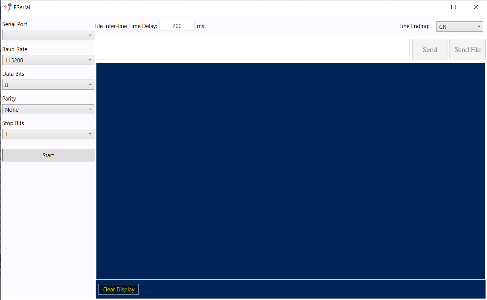

# eserial - *v1.0*

An ***Easy*** and ***Simple*** Serial / COM Port Interface. *eserial* is just an easy and simple interface application for using Serial Port / UART.

## Features

* Auto-detection of Serial Ports
* Selectable Baud-rates
* Selectable Line-endings - CR, LF, CRLF, and None for not sending line separators after each line
* File Transmissions - Text lines are read from any text file and transferred over selected Serial Port
* Inter-line Transmission Gaps - Selectable time in **milliseconds** that is observed between line transmissions of selected file

## Missing Features

* Selection of Stop Bits - Single Stop Bit is used by default
* Selection of Parity Bits - By default, parity is kept None

